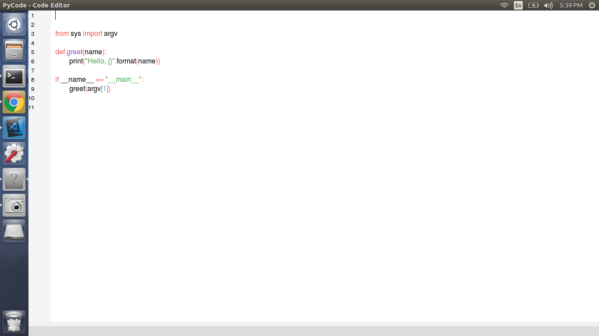
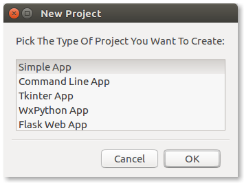

# Pycode
Code Editor


# What Is PyCode?
**PyCode** is a code editor made using ***WxPython** And **Python 3***.


# Usage
Clone this repo and run the `main.py` file.

````bash

    git clone https://github.com/ShardulNalegave/pycode.git PyCode
    cd PyCode
    python[x[.y]] main.py

````


# Screenshots
Some screenshots.





# Contributing
This project is completely **Open-Source**. So, anyone is free to contribute.


#### A Project By [Shardul Nalegave](https://shardul.netlify.com)
#### This Project Is Licensed Under [The MIT LICENSE](./LICENSE)